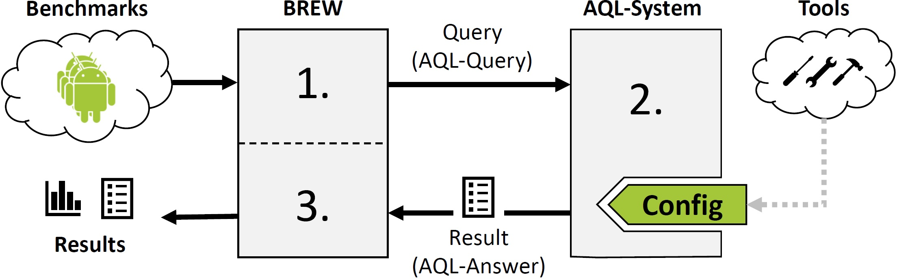

	

# ReproDroid
ReproDroid is a framework which can be used to create, refine and execute reproducible benchmarks for Android app analysis tools.

## Toolchain
The complete ReproDroid framework consists of BREW and its underlying AQL-System which uses the AQL.
The picture below summarizes how the framework works.
BREW takes a set of apps or a complete benchmark as input and issues one AQL-Query per benchmark case.
Then, one query after another arrives at an AQLSystem which produces one AQL-Answer per query.
To do so, it uses analysis tools specified in BREW's configuration file.
All AQL-Answers are gathered by BREW. Based on these answers a final report for e.g. a benchmark is carried out.

	

The tools and results presented in the proposing paper can be downloaded for inspection here.
In order to work with the framework, we suggest to download the up-to-date version of [BREW](https://FoelliX.github.io/BREW "Benchmark Refinement and Execution Wizard"). The underlying [AQL-System](https://FoelliX.github.io/AQL-System "System using the Analysis Query Language") is also available in a newer version.

## Tools
To refine benchmarks and to determine the associated results the *Benchmark Refinement and Execution Wizard (BREW)* has been used. There are two versions available for download:
- [BREW-Website](https://FoelliX.github.io/BREW) or [Github-Project](https://github.com/FoelliX/BREW) (Up-to-date versions)
- [BREW](https://uni-paderborn.sciebo.de/s/aH1jp12VOsG3HIn/download?path=%2Ftools&files=BREW.zip) *(Version used for the compution of the results below)*

A documentation of the *Android App Analysis Query Langauge (AQL)* as well as the *AQL-System* using it is also obtainable online:
- [AQL-System-Website](https://FoelliX.github.io/AQL-System) or [Github-Project](https://github.com/FoelliX/AQL-System) *(Up-to-date versions)*
- [AQL-System](https://uni-paderborn.sciebo.de/s/aH1jp12VOsG3HIn/download?path=%2Ftools&files=AQLSystem.zip) *(Version used by BREW to compute the results below)*

#### Remarks
None of the six evaluated tools are contained in either of these tools.
How to set up a configuration file in order to use a tool is explained in this [tutorial](https://github.com/FoelliX/BREW/wiki).
The six evaluated tools themselves can be downloaded from their associated websites:
- Amandroid:	[https://bintray.com/arguslab/maven/argus-saf/3.1.2](https://bintray.com/arguslab/maven/argus-saf/3.1.2)
- DIALDroid:	[https://github.com/dialdroid-android/DIALDroid](https://github.com/dialdroid-android/DIALDroid)
- DidFail:		[https://www.cert.org/secure-coding/tools/didfail.cfm](https://www.cert.org/secure-coding/tools/didfail.cfm)
- DroidSafe:	[https://mit-pac.github.io/droidsafe-src](https://mit-pac.github.io/droidsafe-src)
- FlowDroid:	[https://github.com/secure-software-engineering/soot-infoflow-android/wiki](https://github.com/secure-software-engineering/soot-infoflow-android/wiki)
- IccTA:		[https://sites.google.com/site/icctawebpage/source-and-usage](https://sites.google.com/site/icctawebpage/source-and-usage)

## Results
All result determined with ReproDroid can be found in this section.

### Droidbench
The refined versions of DroidBench 2.0 and 3.0 as well as the extended DroidBench version can be downloaded here.
Every download includes:

- Benchmark
  - BREW benchmark file *(.ser file)*
  - Benchmark Cases *(.apk files)*
  - Groundtruth *(Expected results in AQL format: .xml)*
  - Source Code *(Eclipse/Android Studio project directories/archives)*
- Results
  - BREW benchmark file including result-summary *(data/data.ser)*
  - AQL-Answers per app *(data/storage/*.xml)*
  - Expected and actual AQL-Answers per benchmark case *(output)*
  - Logfile *(log.txt)*

#### Download
- [DroidBench (extended)](https://uni-paderborn.sciebo.de/s/aH1jp12VOsG3HIn/download?path=%2Fbenchmarks&files=DroidBenchExtended.zip)
- [DroidBench 3.0](https://uni-paderborn.sciebo.de/s/aH1jp12VOsG3HIn/download?path=%2Fbenchmarks&files=DroidBench30.zip)
- [DroidBench 2.0](https://uni-paderborn.sciebo.de/s/aH1jp12VOsG3HIn/download?path=%2Fbenchmarks&files=DroidBench20.zip)

### Extensions for DroidBench
The Feature-Checking and Intent-Matching benchmark extensions can be downloaded here. Both are available for Android API 19 and 26.
Every download includes:

- Benchmark
  - BREW benchmark file (.ser file)
  - Benchmark Cases (.apk files)
  - Groundtruth (Expected results in AQL format: .xml)
  - Source Code (Android Studio project directories/archives)
- Results
  - BREW benchmark file including result-summary (data/data.ser)
  - AQL-Answers per app (data/storage/*.xml)
  - Expected and actual AQL-Answers per benchmark case (output)
  - Logfile (log.txt)

#### Download
- [Feature-Checking (API 19)](https://uni-paderborn.sciebo.de/s/aH1jp12VOsG3HIn/download?path=%2Fbenchmarks&files=FeatureChecking_API19.zip)
- [Feature-Checking (API 26)](https://uni-paderborn.sciebo.de/s/aH1jp12VOsG3HIn/download?path=%2Fbenchmarks&files=FeatureChecking_API26.zip)
- [Intent-Matching (API 19)](https://uni-paderborn.sciebo.de/s/aH1jp12VOsG3HIn/download?path=%2Fbenchmarks&files=IntentMatching_API19.zip)
- [Intent-Matching (API 26)](https://uni-paderborn.sciebo.de/s/aH1jp12VOsG3HIn/download?path=%2Fbenchmarks&files=IntentMatching_API26.zip)

### ICC-Bench
The refined version of ICC-Bench 2.0 can be downloaded here.
It includes:

- Benchmark
  - BREW benchmark file *(.ser file)*
  - Benchmark Cases *(.apk files)*
  - Groundtruth *(Expected results in AQL format: .xml)*
  - Source Code *(Project directories)*
- Results
  - BREW benchmark file including result-summary *(data/data.ser)*
  - AQL-Answers per app *(data/storage/*.xml)*
  - Expected and actual AQL-Answers per benchmark case *(output)*
  - Logfile *(log.txt)*

#### Download
- [ICC-Bench 2.0](https://uni-paderborn.sciebo.de/s/aH1jp12VOsG3HIn/download?path=%2Fbenchmarks&files=ICCBench20.zip)

### DIALDroidBench
The iteratively refined version of DIALDroidBench can be downloaded here. It includes:

- Benchmark
  - BREW benchmark file (.ser file)
  - Benchmark Cases (.apk files)
  - Groundtruth as far as known (Expected results in AQL format: .xml)
  - Source Code (Decompiled .apks)
- Results
  - BREW benchmark file including result-summary (data/data.ser)
  - AQL-Answers per app (data/storage/*.xml)

#### Download
- [DIALDroidBench](https://uni-paderborn.sciebo.de/s/aH1jp12VOsG3HIn/download?path=%2Fbenchmarks&files=DIALDroidBench.zip)

## Publications
- *Do Android Taint Analysis Tools Keep their Promises?* (Felix Pauck, Eric Bodden, Heike Wehrheim)  
Technical Report: https://arxiv.org/abs/1804.02903

# Contact
**Felix Pauck**  
Paderborn University  
fpauck@mail.uni-paderborn.de  
[Homepage](https://cs.uni-paderborn.de/sms/team/group/people/felix-pauck)

